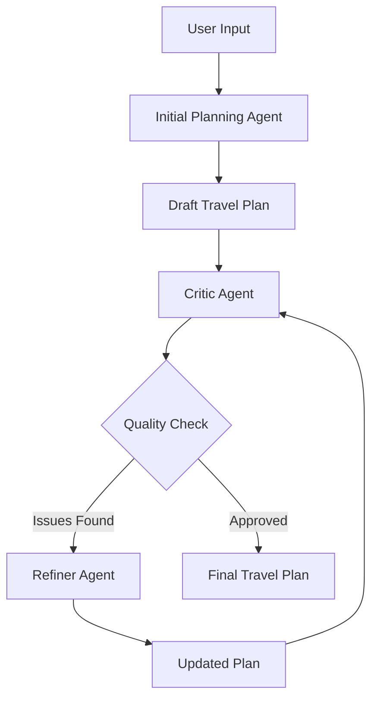

# 🌍 Multi-Agent AI Travel Planning System

*A sophisticated multi-agent system powered by Google ADK for creating comprehensive, budget-friendly travel plans*

---

## 📊 System Overview


*Fig.1: Events tracing for a sample prompt*

This project implements an intelligent multi-agent AI system that creates detailed, budget-conscious travel plans. Simply provide a goal like **"Plan a trip to Paris for 4 people in July 2025"** and the system generates a comprehensive itinerary through collaborative agent interactions.

### 🎯 Key Features
- **Multi-agent collaboration** with specialized roles
- **Real-time data integration** from multiple APIs
- **Iterative refinement** for quality assurance
- **Budget optimization** with cost-effective recommendations
- **Safety-first approach** with travel advisories

---

## 🔄 System Architecture

### Core Components



### Agent Pipeline

| Stage | Agent | Purpose | Output |
|-------|-------|---------|--------|
| **1** | Initial Planning | Creates draft plan using multiple APIs | Structured travel plan |
| **2** | Critic | Reviews quality and accuracy | Improvement suggestions |
| **3** | Refiner | Addresses feedback iteratively | Refined plan |


*Fig.2: Events tracing for another prompt*

---

## 🤖 Agent Specifications

### 🚀 Initial Planning Agent

**Role:** Creates the foundational travel plan

**Capabilities:**
- 🕒 **Time Validation** - Ensures future dates using `get_current_time`
- 🔍 **Destination Research** - Uses `serper_search` for attractions and costs
- 🌤️ **Weather Analysis** - Checks climate via `get_weather`
- ✈️ **Flight Pricing** - Fetches costs through `get_flight_pricing`
- 💱 **Currency Conversion** - Gets exchange rates via `get_currency_rate`
- 📰 **Safety Check** - Reviews travel advisories with `get_news`

**Output Structure:**
- Destination analysis with key attractions
- Day-by-day detailed itinerary
- Comprehensive budget breakdown

### 🔍 Critic Agent

**Role:** Quality assurance and validation

**Quality Criteria:**
- ✅ Evidence of comprehensive tool usage
- ✅ Accurate and specific pricing data
- ✅ Future date validation
- ✅ Research-backed recommendations
- ✅ Realistic budget calculations

**Output:** Specific improvement suggestions or completion approval

### 🛠️ Refiner Agent

**Role:** Iterative improvement based on feedback

**Process:**
1. Analyzes critic feedback
2. Identifies data gaps or inaccuracies
3. Re-runs appropriate tools
4. Updates plan with new information
5. Exits loop when quality standards are met

**Loop Control:** Maximum 5 iterations to prevent infinite loops


*Fig.3: Final planning response after refinement*

---

## 🔌 API Integrations

### Weather Intelligence
**OpenWeatherMap API**
- **Purpose:** Real-time weather and climate data
- **Endpoint:** `https://api.openweathermap.org/data/2.5/weather`
- **Authentication:** API key via `OPENWEATHER_API_KEY`

### Flight Pricing
**Amadeus API**
- **Purpose:** Comprehensive flight pricing data
- **Endpoint:** `https://test.api.amadeus.com/v2/shopping/flight-offers`
- **Authentication:** Bearer token using `AMADEUS_API_KEY` + `AMADEUS_API_SECRET`

### Currency Exchange
**Frankfurter API**
- **Purpose:** Real-time currency exchange rates
- **Endpoint:** `https://api.frankfurter.app/latest`
- **Authentication:** Public API (no key required)

### News & Advisories
**EventRegistry API**
- **Purpose:** Travel advisories and destination news
- **Integration:** Python SDK
- **Authentication:** `NEWS_API_KEY`

### Web Search
**Serper API**
- **Purpose:** Google search for destination research
- **Endpoint:** `https://google.serper.dev/search`
- **Authentication:** `SERPER_API_KEY`

---

## 🚀 Quick Start Guide

### Prerequisites Checklist
- [ ] Python 3.10 or higher
- [ ] Google ADK installed
- [ ] Required API keys (see below)

### Required API Keys
```env
GOOGLE_API_KEY=your_google_studio_api_key
OPENWEATHER_API_KEY=your_openweathermap_key
AMADEUS_API_KEY=your_amadeus_api_key
AMADEUS_API_SECRET=your_amadeus_secret
NEWS_API_KEY=your_eventregistry_key
SERPER_API_KEY=your_serper_key
```

### Installation Steps

1. **Clone Repository**
   ```bash
   git clone <repository-url>
   cd trip_planning_agent
   ```

2. **Setup Virtual Environment**
   ```bash
   python -m venv venv
   source venv/bin/activate  # Windows: venv\Scripts\activate
   ```

3. **Install Dependencies**
   ```bash
   pip install -r requirements.txt
   ```

4. **Configure Environment**
   ```bash
   touch .env
   ```
   
   Add your API keys:
   ```env
   GOOGLE_GENAI_USE_VERTEXAI=FALSE
   GOOGLE_API_KEY=<your-google-studio-api-key>
   OPENWEATHER_API_KEY=<your-openweathermap-key>
   AMADEUS_API_KEY=<your-amadeus-api-key>
   AMADEUS_API_SECRET=<your-amadeus-secret>
   NEWS_API_KEY=<your-eventregistry-key>
   SERPER_API_KEY=<your-serper-key>
   ```

### Launch Options

| Command | Purpose | Interface |
|---------|---------|-----------|
| `adk web` | Web interface | Browser-based GUI |
| `adk run trip_planning_agent` | Terminal interface | Command line |
| `adk api_server` | API server | RESTful endpoints |

---

## 📁 Project Structure

```
trip_planning_agent/
├── 📄 __init__.py               # Package initialization
├── 🤖 agent.py                 # Agent definitions and pipeline
├── 📋 requirements.txt         # Python dependencies
└── 🛠️ tools/
    ├── 📄 __init__.py          # Tools package init
    ├── 💱 currency.py          # Currency exchange rates
    ├── ✈️ flight.py            # Flight pricing data
    ├── 📰 news.py              # Travel news & advisories
    ├── 🔍 serper_search.py     # Web search capabilities
    ├── 🕒 time.py              # Current time utilities
    └── 🌤️ weather.py           # Weather information
```

---

## 🔄 Data Flow

### State Management
- **`current_document`** - Stores the evolving travel plan
- **`criticism`** - Contains feedback from the Critic Agent
- **Shared state** - Enables seamless agent communication

### Quality Assurance Loop
1. Initial plan creation with comprehensive data gathering
2. Quality assessment against predefined criteria
3. Iterative refinement until standards are met
4. Final plan delivery with all requirements satisfied
